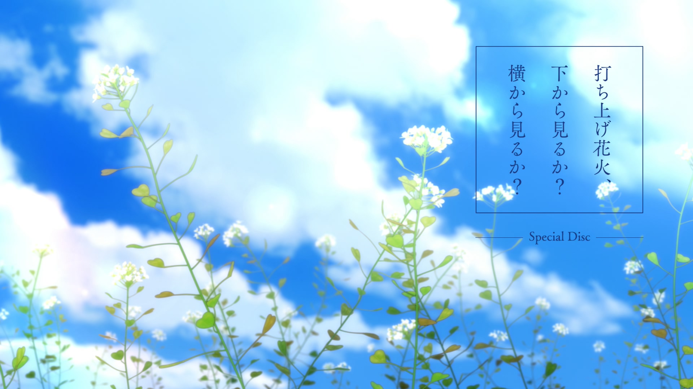

# 歌词

#### 打上花火

> **烟花**
>
> **打ち上げ花火、下から見るか？横から見るか？**
>
> **升空的焰火，从下面看？还是从侧面看？**

- [x] 精准逐字
- [ ] 平均逐字
- [ ] 逐行

# 视频

#### B站

- https://www.bilibili.com/video/av541974146
- https://www.bilibili.com/video/BV1Ci4y1M7oy

# 说明

- `Uchiage Hanabi`即**打上花火**
- 后缀
  - `Airota`千夏字幕组
  
  - `DIY`自制
  
  - `fireworks effect`烟花效果
  
    https://www.bilibili.com/video/BV1Ci4y1M7oy?p=3
  
  - `Nekomoe kissaten`喵萌奶茶屋
  
  - `Vmoe`Vmoe字幕组
    
    https://www.bilibili.com/video/BV1Ci4y1M7oy?p=2
    
    https://karaoke.vmoe.info/
- 不同版本的中日歌词和字幕效果均可能不同

# 封面

